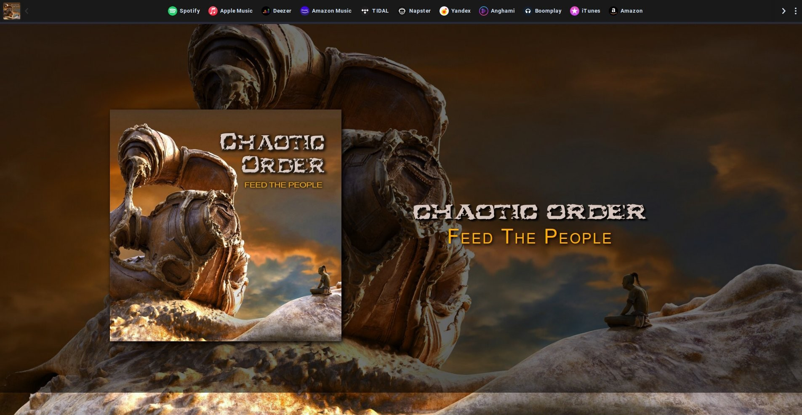

    <h1>
        <a href="https://chaoticordermusic.com/">ChaoticOrderMusic.com</a>
    </h1>
    <h4><b>Website for the band Chaotic Order's New Album Release</b></h4>

### 

----------

## Website Development Guide Snippet

This project was bootstrapped with [Create React App](https://github.com/facebook/create-react-app).

## Available Scripts

In the project directory, you can run:

### `yarn start`

Runs the app in the development mode. 
Open [http://localhost:3000](http://localhost:3000) to view it in the browser.

The page will reload if you make edits. 
You will also see any lint errors in the console.

### `yarn test`

Launches the test runner in the interactive watch mode. 
See the section about [running tests](https://facebook.github.io/create-react-app/docs/running-tests) for more information.

### `yarn build`

Builds the app for production to the `build` folder. 
It correctly bundles React in production mode and optimizes the build for the best performance.

The build is minified and the filenames include the hashes, 
making the web app ready to be deployed.

This site is hosted with [Netlify](https://netlify.com), visit them for more information om deploying and hosting your site.

